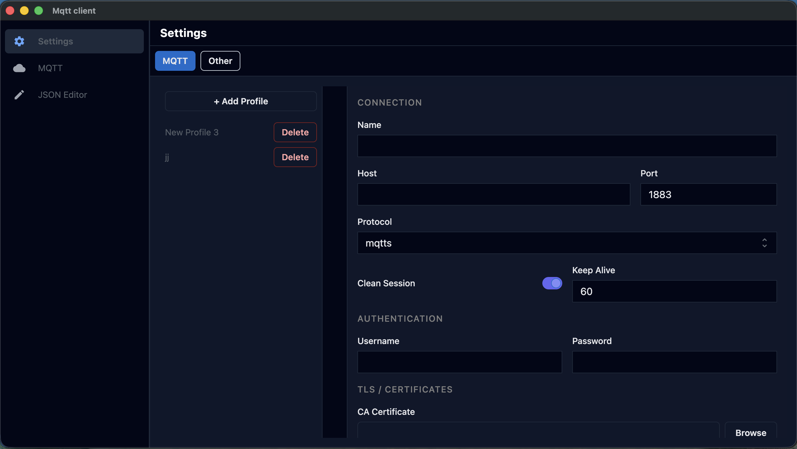

# MQTT Client
## Introduction
I needed a custom mqtt client. First goal was the ability to easely edit json messages.

## Settings section
We can store different connections, each with different settings.

## Messages section
This section is devided into **subscribe**, **publish** and **messages**. Subscribed and discovered topics are visible in the left pane. Each message has a, **COPY** button wich opens the mesage in the editor view.

## Json section
Here the copied message is displayed in a Json editor. We can edit the mesage and topic and publish it.

## Disclaimer
This project is based on the electron react boilerplate.

https://github.com/electron-react-boilerplate/electron-react-boilerplate
